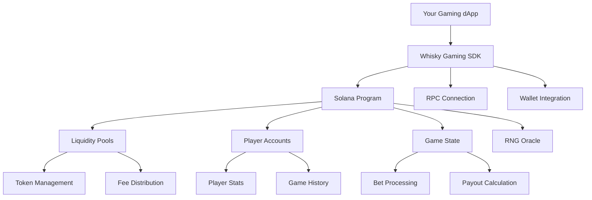

# 🥃 Whisky Gaming Protocol SDK Documentation 🎮

---

## 🚀 **Welcome to the Future of DeFi Gaming**

The Whisky Gaming Protocol SDK empowers developers to build sophisticated gaming applications with integrated DeFi mechanics on Solana. Whether you're creating a casino, prediction market, or skill-based game, our SDK provides everything you need.

## 🌟 **Key Features**

### 🎯 **Core Functionality**
- **🏦 Liquidity Pool Management** - Create and manage gaming liquidity pools
- **🎲 Provably Fair Gaming** - Cryptographically secure random number generation
- **💰 Automated Payouts** - Instant settlement of winning bets
- **📊 Real-time Analytics** - Comprehensive gaming statistics and metrics
- **🛡️ Risk Management** - Built-in house edge and liquidity protection

### 🔧 **Developer Experience**
- **TypeScript First** - Full type safety and IntelliSense support
- **Modular Architecture** - Use only the components you need
- **Comprehensive Error Handling** - Detailed error messages and recovery
- **Battle-tested** - Production-ready with extensive testing
- **Rich Documentation** - Complete guides and API reference

### ⚡ **Performance**
- **Optimized Transactions** - Minimal fees and fast confirmation
- **Batch Operations** - Process multiple actions efficiently
- **Caching Layer** - Reduced RPC calls with intelligent caching
- **Event Streaming** - Real-time updates via WebSocket

---

## 📦 **Quick Start**

### Installation

```bash
npm install @whisky-core/sdk
# or
yarn add @whisky-core/sdk
```

### Basic Usage

```typescript
import { WhiskyGamingClient, createWhiskyClient } from '@whisky-core/sdk';
import { Connection, clusterApiUrl } from '@solana/web3.js';

// Initialize the client
const connection = new Connection(clusterApiUrl('devnet'));
const client = createWhiskyClient({
  connection,
  wallet: yourWallet,
  programId: 'Bk1qUqYaEfCyKWeke3VKDjmb2rtFM61QyPmroSFmv7uw'
});

// Initialize a player
await client.initializePlayer();

// Place a bet
const result = await client.placeBet({
  pool: poolAddress,
  amount: 1000000, // 0.001 tokens (9 decimals)
  bet: [50, 30, 20], // 50%, 30%, 20% probability
  clientSeed: 'my-random-seed'
});

console.log(`Result: ${result.isWin ? 'WIN' : 'LOSE'}`);
console.log(`Payout: ${result.payout} tokens`);
```

---

## 📚 **Documentation Structure**

### 🎓 **Getting Started**
- [📖 Installation Guide](./installation.md)
- [🚀 Quick Start Tutorial](./quickstart.md)
- [⚙️ Configuration](./configuration.md)
- [🔧 Environment Setup](./environment.md)

### 🏗️ **Core Concepts**
- [🏦 Liquidity Pools](./concepts/pools.md)
- [👤 Player Management](./concepts/players.md)
- [🎲 Game Mechanics](./concepts/games.md)
- [💰 Fee Structure](./concepts/fees.md)
- [🛡️ Security Model](./concepts/security.md)

### 🛠️ **API Reference**
- [📋 Complete API Documentation](./api/README.md)
- [🎮 WhiskyGamingClient](./api/client.md)
- [🏦 Pool Operations](./api/pools.md)
- [👤 Player Operations](./api/players.md)
- [🎲 Game Operations](./api/games.md)
- [📊 Analytics & Stats](./api/analytics.md)

### 📝 **Guides**
- [🎯 Building Your First Game](./guides/first-game.md)
- [🏦 Creating Liquidity Pools](./guides/create-pools.md)
- [📊 Implementing Analytics](./guides/analytics.md)
- [🔒 Security Best Practices](./guides/security.md)
- [🚀 Production Deployment](./guides/deployment.md)

### 💡 **Examples**
- [🎰 Casino Games](./examples/casino.md)
- [🎯 Prediction Markets](./examples/predictions.md)
- [🏆 Tournament System](./examples/tournaments.md)
- [💎 NFT Integration](./examples/nft-gaming.md)

### 🛠️ **Advanced Topics**
- [🔧 Custom Game Types](./advanced/custom-games.md)
- [⚡ Performance Optimization](./advanced/optimization.md)
- [🔌 Plugin System](./advanced/plugins.md)
- [📡 Event Streaming](./advanced/events.md)

---

## 🏗️ **Architecture Overview**



---

## 🎮 **Supported Game Types**

### 🎰 **Casino Games**
- **Coin Flip** - Simple 50/50 games
- **Dice** - Customizable probability ranges
- **Roulette** - Classic wheel games
- **Card Games** - Blackjack, Poker variants
- **Slots** - Multi-reel slot machines

### 🎯 **Prediction Markets**
- **Sports Betting** - Real-world event outcomes
- **Political Predictions** - Election and referendum bets
- **Crypto Markets** - Price prediction games
- **Custom Events** - Any binary or multi-outcome event

### 🏆 **Skill-Based Games**
- **Tournaments** - Multi-player competitions
- **Leaderboards** - Ranked gameplay
- **Achievement Systems** - Progress-based rewards
- **Strategy Games** - Chess, poker, and more

---

## 💰 **Economics & Tokenomics**

### 🏦 **Liquidity Pool Model**
- **Automated Market Making** - Dynamic odds based on pool balance
- **LP Token Rewards** - Earn fees as a liquidity provider
- **Risk Management** - Built-in house edge protection
- **Flexible Parameters** - Customizable fee structures

### 💸 **Fee Structure**
- **Protocol Fee** - 3% to Whisky treasury (configurable)
- **Creator Fee** - Up to 20% to game creators
- **Pool Fee** - Rewards for LP providers
- **Jackpot Fund** - Special pool for progressive rewards

### 🎁 **Incentive Mechanisms**
- **Volume Bonuses** - Rewards for high-volume players
- **LP Incentives** - Additional rewards for liquidity providers
- **Referral Program** - Earn from player referrals
- **Governance Tokens** - Participate in protocol governance

---

## 🛡️ **Security & Fair Play**

### 🔐 **Cryptographic Security**
- **Verifiable Random Functions (VRF)** - Provably fair randomness
- **Commit-Reveal Scheme** - Client seed contribution
- **Audit Trail** - All games are recorded on-chain
- **Non-repudiation** - Immutable game results

### 🛡️ **Risk Management**
- **Position Limits** - Maximum exposure per game
- **Circuit Breakers** - Emergency protocol pausing
- **Oracle Security** - Multiple RNG sources
- **Access Controls** - Role-based permissions

### 🔍 **Transparency**
- **Open Source** - Fully auditable code
- **On-chain Data** - All transactions visible
- **Real-time Monitoring** - Public dashboards
- **Community Governance** - Decentralized decision making

---

## 🌐 **Network Support**

| Network | Status | Program ID |
|---------|--------|------------|
| **Mainnet** | 🟢 Live | `Bk1qUqYaEfCyKWeke3VKDjmb2rtFM61QyPmroSFmv7uw` |
| **Devnet** | 🟢 Live | `Bk1qUqYaEfCyKWeke3VKDjmb2rtFM61QyPmroSFmv7uw` |
| **Testnet** | 🟡 Beta | Coming Soon |
| **Localnet** | 🟢 Dev | Local Development |

---

## 🤝 **Community & Support**

### 💬 **Get Help**
- [💬 Discord Community](https://discord.gg/whisky-gaming)
- [🐦 Twitter Updates](https://twitter.com/WhiskyGaming)
- [📧 Email Support](mailto:dev@whisky.game)
- [🐛 GitHub Issues](https://github.com/whisky-gaming/sdk/issues)

### 🤖 **Developer Resources**
- [📖 Developer Portal](https://dev.whisky.game)
- [🎓 Video Tutorials](https://www.youtube.com/c/WhiskyGaming)
- [📱 Sample Applications](https://github.com/whisky-gaming/examples)
- [🔧 Developer Tools](https://tools.whisky.game)

### 🏆 **Ecosystem**
- [🎮 Featured Games](https://games.whisky.game)
- [🏪 Marketplace](https://marketplace.whisky.game)
- [📊 Analytics Dashboard](https://analytics.whisky.game)
- [🗳️ Governance Portal](https://gov.whisky.game)

---

## 🔗 **Quick Links**

| Resource | Link |
|----------|------|
| 🚀 **Get Started** | [Quick Start Guide](./quickstart.md) |
| 📚 **Full Documentation** | [Complete Docs](./api/README.md) |
| 💻 **GitHub Repository** | [Source Code](https://github.com/whisky-gaming/sdk) |
| 🎮 **Live Demo** | [Try It Now](https://demo.whisky.game) |
| 💰 **Earn Rewards** | [Become an LP](https://app.whisky.game/pools) |

---

## 📄 **License**

This project is licensed under the MIT License - see the [LICENSE](./LICENSE) file for details.

---

## 🙏 **Acknowledgments**

- **Solana Foundation** - For the amazing blockchain platform
- **Anchor Framework** - For simplifying Solana development
- **Community Contributors** - For testing and feedback
- **Security Auditors** - For keeping the protocol secure

---

**🎮 Ready to revolutionize gaming on Solana? [Get started now!](./quickstart.md) 🚀** 